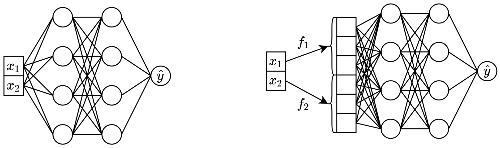

# On Embeddings for Numerical Features in Tabular Deep Learning (NeurIPS 2022)

> [!IMPORTANT]
> Check out the new tabular DL model: [TabM](https://github.com/yandex-research/tabm)

:scroll: [arXiv](https://arxiv.org/abs/2203.05556)
&nbsp; :package: **[Python package](./package/README.md)**
&nbsp; :books: [Other tabular DL projects](https://github.com/yandex-research/rtdl)

This is the official implementation of the paper
"On Embeddings for Numerical Features in Tabular Deep Learning".

# TL;DR

*In one sentence: transforming the original scalar continuous features to vectors
before mixing them in the main backbone (e.g. in MLP, Transformer, etc.) improves
the downstream performance of tabular neural networks.*



*Left: vanilla MLP taking two continuous features as input.*
<br> *Right: the same MLP, but now with embeddings for continuous features.*

In more detail:

- Embedding continuous features means transforming them from scalar representations
  to vectors **before mixing in the main backbone** as illustrated above.
- It turns out that **embeddings for continuous features can (significantly) improve
  the performance of tabular DL models**.
- Embeddings are **applicable to any conventional backbone**.
- In particular, **simple MLP with embeddings can be competitive** with
  heavy Transormer-based models while being significantly more efficient.
- Despite the formal overhead in terms of parameter count, in practice,
  **embeddings are perfectly affordable in many cases**. On big enough
  datasets and/or with large enough number of features and/or with strict enough latency
  requirements, the new overhead associated with embeddings may become an issue.

<details>
<summary><b>Why do embeddings work?</b></summary>

Strictly speaking, there is no single explanation.
Evidently, the embeddings help dealing with various challenges associated
with continuous features and improve the overall optimization properties of models.

In particular, irregularly distributed continuous features (and their irregular joint
distributions with labels) is a usual thing in real world tabular data,
and they pose a major fundamental optimization challenge for traditional
tabular DL models.
**A great reference** for understanding this challenge
(and a great example of addressing those challenges by transforming input space)
is the paper
["Fourier Features Let Networks Learn High Frequency Functions in Low Dimensional Domains"](https://arxiv.org/abs/2006.10739).

However, it is unclear whether irregular distributions is the only reason
why the embeddings are useful.

</details>

# Python package

The [Python package](./package/README.md) in the `package/` directory
is the recommended way to use the paper in practice and for future work.

---

**The rest of the document**:
- [Metrics & Hyperparameters](#how-to-explore-metrics-and-hyperparameters)
- [How to reproduce the reported results](#how-to-reproduce-the-results)
- [How to cite](#how-to-cite)

---

# How to explore metrics and hyperparameters

The `exp/` directory contains numerious results and (tuned) hyperparameters
for various models and datasets used in the paper.

## Metrics

For example, let's explore the metrics for the MLP model.
First, let's load the reports (the `report.json` files):

```python
import json
from pathlib import Path

import pandas as pd

df = pd.json_normalize([
    json.loads(x.read_text())
    for x in Path('exp').glob('mlp/*/0_evaluation/*/report.json')
])
```

Now, for each dataset, let's compute the test score averaged over all random seeds:

```python
print(df.groupby('config.data.path')['metrics.test.score'].mean().round(3))
```

*The output exactly matches Table 3 from the paper:*

```
config.data.path
data/adult              0.854
data/california        -0.495
data/churn              0.856
data/covtype            0.964
data/fb-comments       -5.686
data/gesture            0.632
data/higgs-small        0.720
data/house         -32039.399
data/microsoft         -0.747
data/otto               0.818
data/santander          0.912
Name: metrics.test.score, dtype: float64
```

## Hyperparameters

The above approach can also be used to explore hyperparameters to get intuition
on typical hyperparameter values for different algorithms.
For example, this is how one can compute the median tuned learning rate
for the MLP model:

> [!NOTE]
> For some algorithms (e.g. MLP, MLP-LR, MLP-PLR), more recent projects offer more
> results that can be explored in a similar way. For example, see
> [this paper on TabR](https://github.com/yandex-research/tabular-dl-tabr/).

> [!WARNING]
> **Use this approach with caution.** When studying hyperparameter values:
> 1. Beware of outliers.
> 2. Take a look at raw unaggregated values to get intuition on typical values.
> 3. For a high-level overview, plot the distribution and/or compute multiple quantiles.

```python
print(df[df['config.seed'] == 0]['config.training.lr'].quantile(0.5))
# Output: 0.0002716544410603358
```

# How to reproduce the results

> [!IMPORTANT]
> 
> This section is long.
> **Use the "Outline" feature** on GitHub on in your text editor to get an overview
> of this section.

## Set up the environment

### Software

Preliminaries:
- You may need to change the CUDA-related commands and settings below depending on your setup
- Make sure that `/usr/local/cuda-11.1/bin` is always in your `PATH` environment variable
- Install [conda](https://docs.conda.io/en/latest/miniconda.html)

```bash
export PROJECT_DIR=<ABSOLUTE path to the repository root>
# example: export PROJECT_DIR=/home/myusername/repositories/num-embeddings
git clone https://github.com/yandex-research/tabular-dl-num-embeddings $PROJECT_DIR
cd $PROJECT_DIR

conda create -n num-embeddings python=3.9.7
conda activate num-embeddings

pip install torch==1.10.1+cu111 -f https://download.pytorch.org/whl/torch_stable.html
pip install -r requirements.txt

# if the following commands do not succeed, update conda
conda env config vars set PYTHONPATH=${PYTHONPATH}:${PROJECT_DIR}
conda env config vars set PROJECT_DIR=${PROJECT_DIR}
# the following command appends ":/usr/local/cuda-11.1/lib64" to LD_LIBRARY_PATH;
# if your LD_LIBRARY_PATH already contains a path to some other CUDA, then the content
# after "=" should be "<your LD_LIBRARY_PATH without your cuda path>:/usr/local/cuda-11.1/lib64"
conda env config vars set LD_LIBRARY_PATH=${LD_LIBRARY_PATH}:/usr/local/cuda-11.1/lib64
conda env config vars set CUDA_HOME=/usr/local/cuda-11.1
conda env config vars set CUDA_ROOT=/usr/local/cuda-11.1

# (optional) get a shortcut for toggling the dark mode with cmd+y
conda install nodejs
jupyter labextension install jupyterlab-theme-toggle

conda deactivate
conda activate num-embeddings
```

### Data

LICENSE: by downloading our dataset you accept the licenses of all its components.
We do not impose any new restrictions in addition to those licenses.
You can find the list of sources in the paper.

```bash
cd $PROJECT_DIR
wget "https://www.dropbox.com/s/r0ef3ij3wl049gl/data.tar?dl=1" -O num_embeddings_data.tar
tar -xvf num_embeddings_data.tar
```

## How to reproduce results

The code below reproduces the results for MLP on the California Housing dataset. The pipeline for other algorithms and datasets is absolutely the same.

```
# You must explicitly set CUDA_VISIBLE_DEVICES if you want to use GPU
export CUDA_VISIBLE_DEVICES="0"

# Create a copy of the 'official' config
cp exp/mlp/california/0_tuning.toml exp/mlp/california/1_tuning.toml

# Run tuning (on GPU, it takes ~30-60min)
python bin/tune.py exp/mlp/california/1_tuning.toml

# Evaluate single models with 15 different random seeds
python bin/evaluate.py exp/mlp/california/1_tuning 15

# Evaluate ensembles (by default, three ensembles of size five each)
python bin/ensemble.py exp/mlp/california/1_evaluation
```

The section ["Metrics"](#metrics) shows how to summarize the obtained results.

## Understanding the repository

### Code overview
The code is organized as follows:
- `bin`
    - `train4.py` for neural networks (it implements all the embeddings and backbones from the paper)
    - `xgboost_.py` for XGBoost
    - `catboost_.py` for CatBoost
    - `tune.py` for tuning
    - `evaluate.py` for evaluation
    - `ensemble.py` for ensembling
    - `datasets.py` was used to build the [dataset splits](#data)
    - `synthetic.py` for generating the synthetic GBDT-friendly datasets
    - `train1_synthetic.py` for the experiments with synthetic data
- `lib` contains common tools used by programs in `bin`
- `exp` contains experiment configs and results (metrics, tuned configurations, etc.). The names of the nested folders follow the names from the paper (example: `exp/mlp-plr` corresponds to the MLP-PLR model from the paper).
- `package` contains the Python package for this paper

### Technical notes
- You must explicitly set `CUDA_VISIBLE_DEVICES` when running scripts
- for saving and loading configs, use `lib.dump_config` and `lib.load_config` instead of bare TOML libraries

### Running scripts
The common pattern for running scripts is:
```bash
python bin/my_script.py a/b/c.toml
```
where `a/b/c.toml` is the input configuration file (config). The output will be located at `a/b/c`. The config structure usually follows the `Config` class from `bin/my_script.py`.

There are also scripts that take command line arguments instead of configs (e.g. `bin/{evaluate.py,ensemble.py}`).

### train0.py vs train1.py vs train3.py vs train4.py
You need all of them for reproducing results, but you need only `train4.py` for future work, because:
- `bin/train1.py` implements a superset of features from `bin/train0.py`
- `bin/train3.py` implements a superset of features from `bin/train1.py`
- `bin/train4.py` implements a superset of features from `bin/train3.py`

To see which one of the four scripts was used to run a given experiment, check the "program" field of the corresponding tuning config. For example, here is the tuning config for MLP on the California Housing dataset: [`exp/mlp/california/0_tuning.toml`](./exp/mlp/california/0_tuning.toml). The config indicates that `bin/train0.py` was used. It means that the configs in [`exp/mlp/california/0_evaluation`](./exp/mlp/california/0_evaluation) are compatible specifically with `bin/train0.py`. To verify that, you can copy one of them to a separate location and pass to `bin/train0.py`:
```
mkdir exp/tmp
cp exp/mlp/california/0_evaluation/0.toml exp/tmp/0.toml
python bin/train0.py exp/tmp/0.toml
ls exp/tmp/0
```

# How to cite
```
@inproceedings{gorishniy2022embeddings,
    title={On Embeddings for Numerical Features in Tabular Deep Learning},
    author={Yury Gorishniy and Ivan Rubachev and Artem Babenko},
    booktitle={{NeurIPS}},
    year={2022},
}
```
