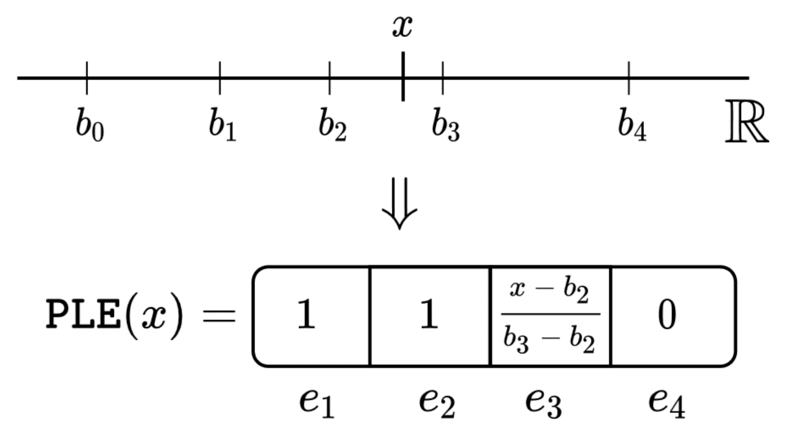

# Python package <!-- omit in toc -->

:scroll: [arXiv](https://arxiv.org/abs/2203.05556)
&nbsp; :books: [Other tabular DL projects](https://github.com/yandex-research/rtdl)

This package provides the officially recommended
implementation of the paper "On Embeddings for Numerical Features in Tabular Deep Learning".

> [!NOTE]
> This package is strongly recommended over prior implementations,
> including the original one used in the paper.
>
> <details>
>
> 1. Compared to the original implementation (the `bin` and `lib` directories),
>    the code in this package is better across all dimensions: correctness, clarity, efficiency.
>    Some differences between this package and the original implementation are explained
>    in the source code of this package in the comments marked with `NOTE[DIFF]`.
> 2. Long time ago, there was also an **unfinished** implementation in the old, and now deprecated,
>    `rtdl` package. If, by any chance, you used it, please, switch to this package.
> </details>

---

- [Installation](#installation)
- [Usage](#usage)
  - [Basics](#basics)
  - [Simple embeddings](#simple-embeddings)
  - [Piecewise-linear encoding \& embeddings](#piecewise-linear-encoding--embeddings)
  - [Periodic embeddings](#periodic-embeddings)
- [Examples](#examples)
- [Practical notes](#practical-notes)
  - [General comments](#general-comments)
  - [Which embeddings to choose?](#which-embeddings-to-choose)
  - [Hyperparameters](#hyperparameters)
  - [Tips](#tips)
- [API](#api)
- [Development](#development)

# Installation

*(RTDL ~ **R**esearch on **T**abular **D**eep **L**earning)*

```shell
pip install rtdl_num_embeddings

# Scikit-learn is an optional dependency. It is needed only for
# computing the bins for the piecewise-linear transformations
# using decision trees: `compute_bins(..., tree_kwargs={...})`.
pip install "scikit-learn>=1.0,<2"
```

# Usage

> [!TIP]
> It is recommended to first read the TL;DR of the paper:
> [link](../README.md#tldr)

## Basics

Let's consider a toy task on tabular data where objects are represented by three continuous features
(for simplicity, other feature types are omitted, but they are covered in the end-to-end example
linked later in this document):

<!-- test main -->
```python
# NOTE: all code snippets can be copied and executed as-is.
import torch
import torch.nn as nn
from rtdl_num_embeddings import (
    LinearEmbeddings,
    LinearReLUEmbeddings,
    PeriodicEmbeddings,
    PiecewiseLinearEncoding,
    PiecewiseLinearEmbeddings,
    compute_bins,
)
# NOTE: pip install rtdl_revisiting_models
from rtdl_revisiting_models import MLP

batch_size = 256
n_cont_features = 3
x = torch.randn(batch_size, n_cont_features)
```

This is how a vanilla MLP **without embeddings** would look like:

<!-- test main -->
```python
mlp_config = {
    'd_out': 1,  # For example, a single regression task.
    'n_blocks': 2,
    'd_block': 256,
    'dropout': 0.1,
}
model = MLP(d_in=n_cont_features, **mlp_config)
y_pred = model(x)
```

And this is how MLP **with embeddings for continuous features** can be created:

<!-- test main -->
```python
d_embedding = 24
embeddings = LinearReLUEmbeddings(n_cont_features, d_embedding)
model_with_embeddings = nn.Sequential(
    # Input shape: (batch_size, n_cont_features)

    embeddings,
    # After embeddings: (batch_size, n_cont_features, d_embedding)

    # NOTE: `nn.Flatten` is not needed for Transformer-like architectures.
    nn.Flatten(),
    # After flattening: (batch_size, n_cont_features * d_embedding)

    MLP(d_in=n_cont_features * d_embedding, **mlp_config)
    # The final shape: (batch_size, d_out)
)
# The usage is the same as for the model without embeddings:
y_pred = model_with_embeddings(x)

# All embedding modules in the package provide the `get_output_shape` method returning
# the shape of the module output, without the batch dimensions:
assert embeddings.get_output_shape() == torch.Size((n_cont_features, d_embedding))
```

In other words, the whole paper is about the fact that having such a thing as
`embeddings` can (significantly) improve the task performance.

The following sections cover all available types of embeddings, including:

- Simple embeddings
- Piecewise-linear embeddings
- Periodic embeddings

> [!TIP]
> The choice between the embedding types is discussed later in this document.

## Simple embeddings

This section covers simple embeddings based on linear layers and ReLU activation.
It is possible to compose arbitrarily deep embeddings of this kind,
as shown in the advanced example below.

| Module                 | Definition for a single feature `x_i` |
| :--------------------- | :------------------------------------ |
| `LinearEmbeddings`     | `Linear(x_i)`                         |
| `LinearReLUEmbeddings` | `ReLU(Linear(x_i))`                   |

**Notes**

The paper focuses on *non-linear* embeddings, so `LinearEmbeddings` is provided only for
completeness.

**Hyperparameters** of `LinearReLUEmbeddings`:

- The default value of `d_embedding` is set with the MLP backbone in mind.
  For Transformer-like models, the embedding size is usually larger and depends on a model.
- For MLP, on most tasks (at least on non-small tasks),
  tuning `d_embedding` will not have much effect.
- See other notes on hyperparameters in ["Practical notes"](#practical-notes).

<!-- test main _ -->
```python
d_embedding = 32
model = nn.Sequential(
    LinearReLUEmbeddings(n_cont_features, d_embedding),
    nn.Flatten(),
    MLP(d_in=n_cont_features * d_embedding, **mlp_config)
)
y_pred = model(x)
```

<details>
<summary>How to compose deeper embeddings</summary>

To further illustrate the overall idea,
let's compose a three-layer embeddings with the goal of reducing the embedding dimension.

<!-- test main _ -->
```python
# NOTE: pip install delu
import delu

d_embedding = 8
embeddings = nn.Sequential(
    # First, each feature is embedded linearly
    LinearEmbeddings(n_cont_features, 48),
    # Second, the non-linearity is applied.
    nn.ReLU(),
    # Finally, the feature embeddings are projected to a lower dimension.
    # NLinear contains `n_cont_features` linear layers, i.e. one per each feature embedding.
    # (in other words, the linear layers are not shared between the features).
    delu.nn.NLinear(n_cont_features, 48, d_embedding)
)
model = nn.Sequential(
    embeddings,
    nn.Flatten(),
    MLP(d_in=n_cont_features * d_embedding, **mlp_config)
)
y_pred = model(x)
```

</details>

## Piecewise-linear encoding & embeddings

*(Described in Section 3.2 of the paper)*



*The above figure illustrates the piecewise-linear encoding.
The scalar feature $x$ is encoded to a vector using four bins:
$[b_0, b_1], [b_1, b_2], [b_2, b_3], [b_3, b_4]$.*

| Module                                        | Definition for a single feature `x_i` |
| :-------------------------------------------- | :------------------------------------ |
| `PiecewiseLinearEncoding`                     | `PLE(x_i)`                            |
| `PiecewiseLinearEmbeddings(activation=False)` | `Linear(PLE(x_i))`                    |
| `PiecewiseLinearEmbeddings(activation=True)`  | `ReLU(Linear(PLE(x_i)))`              |

In the above table, `PLE` stands for "Piecewise-linear encoding".

**Notes**

There are two distinct modules: `PiecewiseLinearEncoding` and `PiecewiseLinearEmbeddings`.

`PiecewiseLinearEmbeddings` is similar to all other modules in this package, and
produces object representations of the shape `(n_features, d_embedding)`. The intuition behind
`PiecewiseLinearEmbeddings` is that each bin receives its own trainable embedding, and the feature
embedding is the aggregation of its bin embeddings with the aggregation weights provided by the
piecewise-linear *encoding*.

`PiecewiseLinearEncoding` is different from all other modules in this package.
It represents a fixed (non-trainable) transformation, fully defined by the provided bin boundaries,
as illustrated above. Its output is the concatenation of the piecewise-linear representations
of all features, i.e. this representation has the shape `(d_encoding,)`, where `d_encoding` equals
the total number of bins across all features. Because of that, `PiecewiseLinearEncoding` can be used
only with MLP-like models, but not with Transformer-like models.

In practice, if there is enough data to train additional weights,
`PiecewiseLinearEmbeddings` may be a better starting point even for MLP-like models.
In particular, `PiecewiseLinearEmbeddings` makes it possible to set a large number of bins,
but a small embedding size.

**Hyperparameters**

> [!IMPORTANT]
> For tuning hyperparameters with the TPE sample from Optuna, as it was done in the paper,
> take the tuning spaces from the more recent [TabM](https://arxiv.org/abs/2410.24210) paper.

- The default number of bins in `compute_bins` is set with MLPs in mind.
- For `PiecewiseLinearEmbeddings`, by default, use `version="B"` and `activation=False`.
- The `version` argument of `PiecewiseLinearEmbeddings` defines implementation details,
  such as parametrization and initialization. "A" is the original version used in the paper.
  "B" is the version used in the different paper about the TabM model.
- The possible starting points are `d_embedding=12` with `activation=False`
  and `d_embedding=24` with `activation=True`.
  For Transformer-like models, the embedding size is usually larger and depends on a model.
- Some models outside of this project provide different recommendations for default hyperparameters.
- See other notes on hyperparameters in ["Practical notes"](#practical-notes).

<!-- test main _ -->
```python
X_train = torch.randn(10000, n_cont_features)
Y_train = torch.randn(len(X_train))  # Regression.

# Quantile-based bins.
bins = compute_bins(X_train)

# Target-aware tree-based bins.
bins = compute_bins(
    X_train,
    # NOTE: requires scikit-learn>=1.0 to be installed.
    tree_kwargs={'min_samples_leaf': 64, 'min_impurity_decrease': 1e-4},
    y=Y_train,
    regression=True,
)

d_embedding = 12
model = nn.Sequential(
    PiecewiseLinearEmbeddings(bins, d_embedding, activation=False, version="B"),
    nn.Flatten(),
    MLP(d_in=n_cont_features * d_embedding, **mlp_config)
)
y_pred = model(x)

total_n_bins = sum(len(b) - 1 for b in bins)
model = nn.Sequential(
    PiecewiseLinearEncoding(bins),
    MLP(d_in=total_n_bins, **mlp_config)
)
y_pred = model(x)
```

## Periodic embeddings

*(Described in Section 3.3 of the paper)*

| Module                           | Definition for a single feature `x_i`                            |
| :------------------------------- | :--------------------------------------------------------------- |
| `PeriodicEmbeddings(lite=False)` | `ReLU(Linear(CosSin(2 * pi * Linear(x, bias=False))))`           |
| `PeriodicEmbeddings(lite=True)`  | Same as above, but the outer `Linear` is shared between features |

In the above table:

- `CosSin` is a pseudo-module
  that applies the `cos` and `sin` functions in parallel and concatenates the result.
  In particular, it means that the output size is twice the input size.
- The weights of the innermost `Linear` layer can be interpreted as **frequencies**,
  which is reflected in the argument names of `PeriodicEmbeddings`.

**Notes**

- `PeriodicEmbeddings` implements what is also known as "PLR" embeddings.

**Hyperparameters**

> [!IMPORTANT]
> For tuning hyperparameters with the TPE sample from Optuna, as it was done in the paper,
> take the tuning spaces from the more recent [TabM](https://arxiv.org/abs/2410.24210) paper.

- The `lite` option is introduced in a different paper
  ([this one](https://github.com/yandex-research/tabular-dl-tabr/)).
  It makes the embedding significantly more lightweight, and, on some tasks, the performance loss
  is not critical. `lite=True` is a reasonable starting point.
- `n_frequencies` is `out_features` of the innermost `Linear` layer.
- The default value of `d_embedding` is set with the MLP backbone in mind.
  For Transformer-like models, the embedding size is usually larger and depends on a model.
- **The `frequency_init_scale` hyperparameter is important**. While the default values is safe,
  on some tasks, different values may be needed to reveal the full potential of the periodic embedding.
  <details><summary>How to tune <code>frequency_init_scale</code></summary>

  **Prioritize testing smaller values, because they are safer:**

  - Smaller-than-the-optimal value will still yield decent performance.
  - Larger-than-the-optimal value can lead to bad performance.
  - Because of the above, the default value is already small
    (usually, there is no need to try smaller-than-the-default values).

  Some approximate numbers:

  - For 25% of tasks, the optimal `frequency_init_scale` is less than 0.03.
  - For 50% of tasks, the optimal `frequency_init_scale` is less than 0.05.
  - For 75% of tasks, the optimal `frequency_init_scale` is less than 0.5.

  Other comments:

  - In practice, with enough budget for tuning (e.g. 50-100 trials of the TPE Optuna sampler),
    a reasonable distribution for `frequency_init_scale` is `LogUniform[0.01, 1.0]`.
    In research projects, it can be `LogUniform[0.01, 10.0]`.
  - If the budget is low, than it is better to reduce the upper bound.
    Another option is to exclude `frequency_init_scale` from tuning,
    since the default value is safe for most tasks.

  </details>

- See other notes on hyperparameters in ["Practical notes"](#practical-notes).

<!-- test main _ -->
```python
d_embedding = 24
model = nn.Sequential(
    PeriodicEmbeddings(n_cont_features, d_embedding, lite=False),
    nn.Flatten(),
    MLP(d_in=n_cont_features * d_embedding, **mlp_config)
)
y_pred = model(x)
```

# Examples

The [example.ipynb](./example.ipynb) notebook **(Colab link inside)**
provides an example of training a model with embeddings.

# Practical notes

## General comments

- **Embeddings for continuous features are applicable to most tabular DL models**
  and often lead to better performance.
- Despite the formal overhead in terms of parameter count,
  **in practice, embeddings are perfectly affordable,** even on large datasets.
  That said, with large enough number of features and/or with strict enough latency requirements,
  the new overhead associated with embeddings may become an issue.
- MLPs with embeddings can perform on par or even better than Transformer-like models
  (e.g. FT-Transformer), while being significantly more efficient.

## Which embeddings to choose?

> [!NOTE]
> This section is written with MLP-like models in mind, though some advice is applicable
> to Transformer models as well.

**General guidelines**

- If you have not used embeddings before, try `LinearReLUEmbeddings` for a quick start to get
  familiar with the interface.
- To choose between `PiecewiseLinearEmbeddings` and `PeriodicEmbeddings`, a possible strategy is to
  try both with default hyperparameters, and tune what works best on a given task.
- If the provided advanced embeddings are not suitable for any reason,
  consider composing deep simple embeddings as shown in [Simple embeddings](#simple-embeddings).
- On smaller datasets, consider trying `PiecewiseLinearEncoding` with a small number of bins
  (this idea is not tested, since small datasets are not covered in the paper).
- Learn the proc and cons below to make more informed decision.

**Pros & Cons**

`LinearReLUEmbeddings`

- Pros: lightweight; ease to use.
- Cons: usually, the performance is lower compared to more advanced embeddings, though still
  better than without embeddings.

`PiecewiseLinearEmbeddings`

- Pros: good average performance; high peak performance on some datasets;
  less sensitive to data preprocessing; easier to understand and reason about compared to the
  periodic embeddings.
- Cons: requires the additional step of the bin computation before the training (this can be
  important when full end-to-end trainability is required); on some datasets, the optimal number
  of bins may be low (in such cases, the performance benefits may also be limited).

`PeriodicEmbeddings`

- Pros: good average performance; has a reliable default configuration; contrary to the
  piecewise-linear embeddings, does not introduce any additional computation steps.
- Cons: the behavior and hyperparameters are harder to interpret compared to the piecewise-linear
  embeddings; too high values of the `frequency_init_scale` hyperparameter can lead to bad
  performance.

`PiecewiseLinearEncoding`. This module is a bit less explored.
Perhaps, it may worth attention on smaller datasets, with somewhat lower number of bins.

## Hyperparameters

- The default hyperparameters are set with MLPs in mind.
  For Transformer-like models, one may need to (significantly) increase `d_embedding`.
- In the paper, for hyperparameter tuning, the
  [TPE sampler from Optuna](https://optuna.readthedocs.io/en/stable/reference/samplers/generated/optuna.samplers.TPESampler.html)
  was used with `study.optimize(..., n_trials=100)` (sometimes, `n_trials=50`).
- For embeddings ending with a non-linear activation (i.e. `activation=True` in some of the modules),
  the minimum reasonable embedding size is larger than for embeddings ending with linear layers.
  The default values and recommendations in this package follow this guideline.

## Tips

- The proposed embeddings are applicable only to continuous ("numerical") features,
  so they should not be applied to binary or categorical features.
- It is possible to embed only a subset of features (e.g. to improve efficiency).
- It is possible to combine embeddings and apply different embeddings to different features
  (e.g. when some features need different embedding hyperparameters than others).
- If an embedding ends with a linear layer, and its output is passed to MLP, then that linear layer
  can be fused with the first linear layer of MLP after the training.
- (An optional advanced tip for those who read such long documents until the end)
  On some datasets, MLP with *linear* embeddings (i.e. `LinearEmbeddings`) performs better than MLP,
  which is intriguing (the paper does not provide explanations for why that happens, and this
  phenomenon does not happen very often). Combined with the previous point, it means that, on some
  datasets, one can train MLP with linear embeddings and transform it to a plain embedding-free MLP
  after the training, thus obtaining better MLP without any overhead on inference.

# API

There are two ways to explore the available API and docstrings.

(1) Generate the documentation (requires [Pixi](https://pixi.sh) to be installed):

```shell
git clone https://github.com/yandex-research/rtdl-num-embeddings
cd rtdl-num-embeddings/package
pixi run docs
```

(2) Open the source file and:
- On GitHub, use the Symbols panel.
- In VSCode, use the [Outline view](https://code.visualstudio.com/docs/getstarted/userinterface#_outline-view).
- Check the `__all__` variable.

# Development

<details>

Set up the environment:

```
pixi install
```

Use this command before committing:

```
make pre-commit
```

Publish the package to PyPI (requires PyPI account & configuration):

```
pixi run -e dev flit publish
```

</details>
